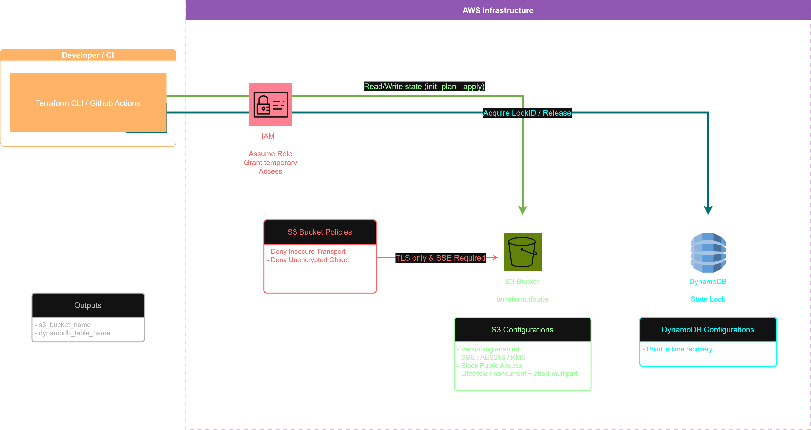

# Terraform Backend Bootstrap (S3 + DynamoDB)


This module provisions the **infrastructure foundation** required to host the **remote Terraform state** (`remote backend`)
in a **secure, persistent, and collaborative** manner.

It serves as a **bootstrap project**, meaning it is executed once to **initialize the Terraform backend** that will later be reused by other Terraform modules and environments. By automating this step, you ensure that every future Terraform deployment starts from a consistent, version-controlled, and secure state management layer.

It automatically creates and configures the following AWS resources :

- **S3 Bucket** 
- **DynamoDB Table** 
- **IAM Policies and Roles** 

Once these resources are created, other Terraform projects can reference this backend configuration to manage their own state files remotely.

---

## Why Use a Remote Backend ?

<p align="justify">
Terraform stores its state (<code>terraform.tfstate</code>) to track the real-world infrastructure.  
By default, this file is stored locally, which quickly becomes unreliable in collaborative or automated environments.  
A local backend cannot prevent concurrent executions, ensure security, or maintain a single source of truth across environments.
</p>

<p align="justify">
To address these issues, the remote backend centralizes and secures state management using <strong>Amazon S3</strong> and <strong>DynamoDB</strong> :
</p>

- <strong>S3 Bucket</strong> — hosts the `terraform.tfstate` file in a durable, encrypted and centralized storage location. It supports versioning for rollback, lifecycle policies for cleanup and ensures consistent access from any environment.  

- <strong>DynamoDB Table</strong> — manages <em>state locking</em> to prevent concurrent executions of multiple users or pipelines from running 
  <code>terraform apply</code> simultaneously. This lock mechanism preserves the integrity of infrastructure operations and avoids race conditions.  

- <strong>IAM Policies</strong> — define strict access controls to the backend. Combined with OIDC authentication from Github Actions, they enable temporary, secure, and auditable access to AWS resources without long-lived credentials.

<p align="justify">
This configuration provides a reliable and collaborative foundation for Terraform workflows — ensuring consistent, secure, and concurrent-safe deployments across all environments.
</p>


---

## Logical Architecture Overview

The diagram below illustrates how the **Terraform Backend Bootstrap** operates.  
It highlights the interactions between the **developer/CI environment**, the **AWS infrastructure**, and the **remote state backend** components (**S3 + DynamoDB**).

<p align="center">
  
</p>

---

## Connecting Projects to the Remote Backend

Once the **“backend bootstrap”** is provisioned, all other Terraform projects (staging, prod, etc) can reuse the same remote backend to store their state securely in the centralized S3 bucket and DynamoDB table.

Each project declares the backend configuration in a `backend.tf` file to reference the remote backend :

> ```hcl
>terraform {
> backend "s3" {...}
>}
> ```  

and will **no longer store local state**, ensuring consistency, security, and multi-user collaboration.

---

## References & Sources
The following official resources were used as guidance for designing and implementing this Terraform backend :

- 📘 **[Terraform Docs – S3 Backend Configuration](https://developer.hashicorp.com/terraform/language/backend/s3)**  
  Official HashiCorp documentation on configuring and securing Terraform remote backends using Amazon S3.  

- 📘 **[Terraform Registry – FlexibleEngine Remote State Backend Guide](https://registry.terraform.io/providers/FlexibleEngineCloud/flexibleengine/latest/docs/guides/remote-state-backend)**  
  Reference example for remote backend configuration and secure multi-environment state management.  

- ☁️ **[AWS Prescriptive Guidance – Managing Terraform State and Backends](https://docs.aws.amazon.com/prescriptive-guidance/latest/getting-started-terraform/states-and-backends.html)**  
  AWS best practices for organizing, protecting, and maintaining Terraform state files and backend infrastructure.  


---